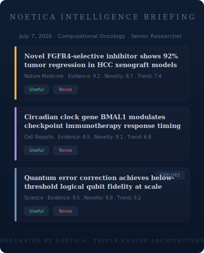
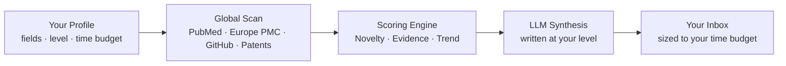
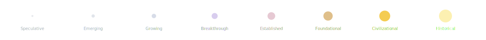

<div align="center">


[](https://opensource.org/licenses/MIT)
[](#get-early-access)
[](https://ziglang.org/)
[](https://www.python.org/)

[How It Works](#how-it-works) · [Architecture](#the-triple-engine-architecture) · [Principles](#design-principles) · [Get Access](#get-early-access)

</div>

---

Noetica scans new papers, patents, funding rounds, and clinical trials as they are published, scores each one for genuine scientific significance, and emails you a briefing written at your level — beginner or specialist — covering only the fields you chose.

It runs on three engines — **Python** for orchestration, **Zig** for the compute-heavy graph scoring, and an **LLM** for synthesis — entirely on free-tier infrastructure, so it costs $0 to run at any scale.

<div align="center">
<br>

<br>
<sub><i>Illustrative mockup of a Noetica Intelligence Briefing. Swap in a real digest screenshot once available.</i></sub>
<br><br>
</div>

---

## How It Works


<details>
<summary>Prefer plain text? Expand for the Mermaid source.</summary>



</details>

1. **Set your boundaries.** A short form captures your fields of interest, your expertise level, and how much time you have to read.
2. **Noetica scans continuously.** On a scheduled cycle, it pulls from open sources — PubMed, Europe PMC, GitHub, NIH RePORTER, and public patent and funding databases.
3. **The Scoring Engine ranks everything.** Every discovery is scored across three dimensions — see the [NET framework](#the-triple-engine-architecture) below.
4. **An LLM writes your summary.** Top-ranked items are synthesized into one briefing, written at the technical depth you asked for.
5. **It lands in your inbox.** No dashboard, no app — just an email, on schedule.

---

## Why Noetica Is Different

- **$0 compute.** No paid APIs — RSS aggregators, public REST APIs, and government databases (NIH RePORTER, Europe PMC) replace enterprise data contracts entirely.
- **Consent is a hard boundary.** Uncheck "Research Papers" and nothing tagged as a paper reaches your inbox — even a discovery the Scoring Engine ranks as globally significant.
- **A deliberate serendipity budget.** Roughly 20% of every digest is reserved for high-impact discoveries *outside* your selected fields, specifically to counter echo-chamber effects.
- **Sized to your actual time.** Tell it you have 5 minutes, and the digest is mathematically trimmed to the top 3 discoveries — not the top 20 with a suggestion to skim.

---

## The Triple-Engine Architecture

| Engine | Role | Why this choice |
|:---|:---|:---|
| **Python** (`main.py`) | Orchestration, fetchers, subscriber routing | Ecosystem depth for async I/O and data wrangling |
| **Zig** (`zig_engine/`) | Compiles to a standalone binary for graph scoring | Compiled speed for O(N^2) graph math, without the Python GIL in the way |
| **LLM** (Gemini / Groq) | Synthesizes ranked discoveries into a personalized summary | Reasoning depth needed to write at variable expertise levels |

Every discovery is scored against the **NET framework**:

- **Novelty** — breakthrough methodology vs. established paradigm
- **Evidence** — methodological rigor: sample size, empirical strength
- **Trend** — citation momentum and cross-disciplinary graph centrality

---

## Active Learning Loop

Every discovery in the daily digest ships with a two-button control: **Useful** or **Noise**. On the next scoring cycle (08:00 IST daily), `feedback.py` cross-references this feedback against the knowledge graph:

- **Useful** — boosts adjacent nodes sharing the same domain or methodology.
- **Noise** — down-weights that node path, so similar signal is filtered more aggressively going forward.

This keeps ranking aligned with what expert readers actually find valuable — not just what the graph predicts.

---

## Knowledge Lifecycle & Timelines

Every node in the graph moves through a lifecycle as evidence accumulates:



Digests also group discoveries by era of impact:

| Timeline | Scope | Core Question | Example |
|:---|:---|:---|:---|
| **Foundational** | 5,000+ years | What changed civilization? | Calculus, Germ Theory, Transistors |
| **Modern** | Last 50 years | What changed science? | CRISPR-Cas9, AlphaFold, mRNA |
| **Emerging** | Last 5 years | What might change the future? | Quantum Error Correction, LLMs |

---

## Design Principles

Principles that guide feature decisions, in order of priority:

1. Scientific significance over popularity.
2. Social signals inform ranking; they don't drive it.
3. Discoveries are the primary entity — not the papers describing them.
4. A knowledge graph, not a flat category tree.
5. Taxonomy evolves; it isn't hardcoded.
6. Evidence outranks attention.
7. Cross-disciplinary work is weighted higher.
8. Open data sources first.
9. Personalized, without becoming an echo chamber.
10. Long-term impact over short-term hype.

---

## Get Early Access

Noetica is in closed beta.

1. Request access via the onboarding form (link provided by your beta administrator) — you'll set your fields, expertise level, and reading-time budget.
2. Noetica maps your profile and configures the Scoring Engine to your domain intersections.
3. Your first briefing arrives on the next scheduled cycle — no login required.

---

## Quick Start

```bash
# Clone
git clone https://github.com/Noetica-Intelligence/Noetica.git
cd Noetica

# Install Python dependencies
make install

# Build the Zig scoring engine
make build-engine

# Set your .env variables (see below), then run:
make run
```

<details>
<summary>Environment variables</summary>

| Variable | Purpose |
|:---|:---|
| `GEMINI_API_KEY` / `GROQ_API_KEY` | LLM synthesis |
| `GOOGLE_SHEET_ID` | Subscriber profiles |
| `FEEDBACK_SHEET_ID` | Active learning database |
| `SENDER_EMAIL` | SMTP delivery (email) |
| `SENDER_PASSWORD` | SMTP delivery (app password) |

Copy `.env.example` to `.env` and fill in your values.

</details>

---

## Deployment

Noetica runs serverless on GitHub Actions:

1. A cron-scheduled workflow spins up an Ubuntu runner.
2. It installs Python dependencies and compiles the Zig engine from source.
3. It runs the pipeline — fetch, score, synthesize.
4. Digests are generated and sent via SMTP.
5. The runner shuts down — $0 ongoing compute cost.

---

## Repository Structure

```text
Noetica/
|
|-- README.md              
|-- LICENSE                 
|-- CONTRIBUTING.md         
|-- CODE_OF_CONDUCT.md      
|-- SECURITY.md             
|-- CHANGELOG.md            
|-- ROADMAP.md              
|-- CITATION.cff            
|-- Makefile                
|
|-- src/                    # Python orchestrator
|-- zig_engine/             # Zig scoring engine
|-- assets/                 # SVGs, logos, visual assets
|-- docs/                   # Architecture and design docs
|-- examples/               # Example payloads and digest templates
|-- benchmarks/             # Zig engine performance metrics
|-- notebooks/              # Data analysis and algorithmic testing
|-- tests/                  # Unit and integration tests
|-- scripts/                # Deployment and utility scripts
`-- .github/                # Actions workflows and issue templates
```

---

## Citation

If you use Noetica in your research, please cite:

```bibtex
@software{noetica2026,
  title   = {Noetica: An Autonomous Scientific Intelligence Engine},
  author  = {Noetica Intelligence},
  year    = {2026},
  url     = {https://github.com/Noetica-Intelligence/Noetica}
}
```

---

## Contributing

Issues and PRs are welcome, especially around new data connectors and scoring refinements. Please see [CONTRIBUTING.md](CONTRIBUTING.md) before opening a large PR so direction stays aligned.

## Roadmap

See [ROADMAP.md](ROADMAP.md) for upcoming features and long-term vision.

## License

MIT — see [LICENSE](LICENSE).
