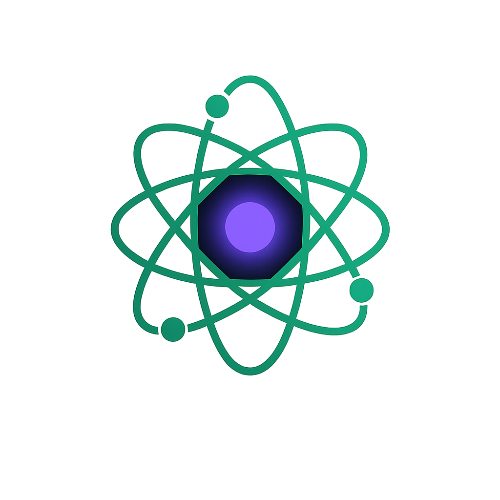
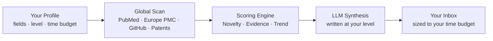

<div align="center">



# Noetica
**Mapping the Evolution of Human Knowledge.**

[](https://opensource.org/licenses/MIT)
[](#7-how-to-get-noetica-early-access)
[](https://ziglang.org/)
[](https://www.python.org/)

[How It Works](#1-how-it-works) · [Architecture](#3-the-triple-engine-architecture) · [Principles](#6-10-non-negotiable-principles) · [Get Access](#7-how-to-get-noetica-early-access)

</div>

---

Noetica scans new papers, patents, funding rounds, and clinical trials as they are published, scores each one for genuine scientific significance, and emails you a briefing written at your level (beginner or specialist) covering only the fields you requested.

It runs on three engines — **Python** for orchestration, **Zig** for the compute-heavy graph scoring, and an **LLM** for synthesis — entirely on free-tier infrastructure, costing $0 to run at any scale.

<div align="center">
  <br>
  <i><!-- PLACEHOLDER: Insert high-res screenshot of the actual email digest here --></i>
  <br>
</div>

---

## 1. How It Works



1. **Set your boundaries:** A short form captures your fields of interest, your expertise level, and how much time you have to read.
2. **Noetica scans continuously:** On a scheduled cycle, it pulls from open sources — PubMed, Europe PMC, GitHub, NIH RePORTER, and public patent databases.
3. **The Scoring Engine ranks everything:** Every discovery is scored across three dimensions — see the [NET framework](#3-the-triple-engine-architecture) below.
4. **An LLM writes your summary:** Top-ranked items are synthesized into one briefing, written at the technical depth you requested.
5. **It lands in your inbox:** No dashboard to check, no app to install — just a precision email, on schedule.

---

## 2. Why Noetica Is Different

- **$0 Compute:** By explicitly leveraging RSS aggregators, public REST APIs, and government databases (NIH RePORTER, Europe PMC), Noetica completely bypasses expensive enterprise data contracts.
- **Consent is a Hard Boundary:** Uncheck "Research Papers" and nothing tagged as a paper reaches your inbox, even a discovery the Scoring Engine ranks as globally significant.
- **A Deliberate Serendipity Budget (80/20):** Roughly 20% of every digest is mathematically reserved for high-impact discoveries *outside* your selected fields, specifically to combat algorithmic echo-chambers and spark cross-disciplinary innovation.
- **Sized to Your Actual Time:** Tell it you have 5 minutes, and the digest is aggressively trimmed to the top 3 absolute highest-scoring discoveries, rather than presenting 20 links with a suggestion to skim.

---

## 3. The Triple-Engine Architecture

| Engine | Role | Rationale |
|:---|:---|:---|
| **Python** (`main.py`) | Orchestration, fetchers, and subscriber routing | Leverages the massive ecosystem depth for async I/O and data wrangling |
| **Zig** (`zig_engine/`) | Compiles to a standalone binary for graph scoring | Provides compiled C-level speed for O(N²) graph mathematics, avoiding the Python GIL |
| **LLM** (Gemini/Groq) | Synthesizes ranked discoveries into an HTML summary | Unlocks the reasoning depth required to dynamically write at variable expertise levels |

Every discovery is scored against the **NET framework**:

- **Novelty:** Breakthrough methodology versus established paradigms.
- **Evidence:** Methodological rigor, sample sizes, and empirical strength.
- **Trend:** Citation momentum and cross-disciplinary graph centrality.

---

## 4. Active Learning Loop (Community Consensus)

Every discovery in the daily digest ships with a two-button minimalist control: **Useful** or **Noise**. On the next scoring cycle (08:00 IST daily), the Python Orchestrator (`feedback.py`) cross-references this feedback securely via Google Sheets against the knowledge graph:

- **Useful:** Mathematically boosts adjacent nodes sharing the same domain or methodology.
- **Noise:** Down-weights that specific structural node path, forcing the Zig Engine to filter similar noise more aggressively in future cycles.

This ensures the intelligence engine continuously aligns its mathematical ranking with what expert readers actually find valuable in the real world.

---

## 5. Knowledge Lifecycle & Timelines

Every node in the graph moves through a lifecycle as empirical evidence accumulates:

`Speculative → Emerging → Growing → Breakthrough → Established → Foundational → Civilizational → Historical`

Digests intentionally group discoveries by their era of impact:

| Timeline | Scope | Core Question | Example |
|:---|:---|:---|:---|
| **Foundational** | 5,000+ years | What changed civilization? | Calculus, Germ Theory, Transistors |
| **Modern** | Last 50 years | What changed science? | CRISPR-Cas9, AlphaFold, mRNA |
| **Emerging** | Last 5 years | What might change the future? | Quantum Error Correction, LLMs |

---

## 6. 10 Non-Negotiable Principles

These principles serve as the constitution of the Noetica Engine. They override all feature decisions:

1. Optimize for scientific significance, not popularity.
2. Social signals inform ranking; they do not drive it.
3. Discoveries are the primary entities, not papers.
4. Knowledge graph over flat category trees.
5. Taxonomy evolves autonomously; it is not hardcoded.
6. Evidence outranks attention, always.
7. Cross-disciplinary work is weighted exponentially higher.
8. Open-source data sources first.
9. Personalized, without becoming an echo chamber.
10. Long-term impact over short-term hype.

---

## 7. How to Get Noetica (Early Access)

Noetica is currently in a closed beta.

1. **Request Access:** Fill out our official Noetica Onboarding Form (link provided by your beta administrator). Set your intellectual boundaries, reading time limits, and expertise level.
2. **The AI Maps Your Profile:** Once submitted, Noetica's backend immediately maps your unique parameters. It calculates your domain intersections and programs the Scoring Engine to hunt specifically for you.
3. **Receive Your Intelligence:** On the very next scheduled cycle, your first beautifully formatted, highly-personalized AI Intelligence Briefing will drop directly into your email inbox. 

*Prepare to stop searching for science, and let the science find you.*

---

## 8. Quick Start (for contributors)

> The commands below follow the pipeline described in [Deployment](#9-deployment--configuration). 

```bash
# Clone
git clone https://github.com/Noetica-Intelligence/Noetica.git
cd Noetica

# Install Python dependencies
make install

# Build the Zig scoring engine
make build-engine

# Ensure your .env variables are set, then run the pipeline
make run
```

---

## 9. Deployment & Configuration

Noetica is designed to be fully serverless via GitHub Actions. 

1. A YAML workflow in `.github/workflows` spins up an Ubuntu cloud runner on a cron schedule.
2. It installs the Python dependencies and compiles the Zig engine from source.
3. It executes the Python pipeline, fetching global data and scoring the graph.
4. The HTML digests are generated and dispatched concurrently via SMTP.
5. The runner spins down, costing $0 in perpetual compute.

### Environment Requirements
- `GEMINI_API_KEY` or `GROQ_API_KEY`
- `GOOGLE_SHEET_ID` (Subscriber profiles)
- `FEEDBACK_SHEET_ID` (Active Learning database)
- `SENDER_EMAIL` & `SENDER_PASSWORD` (App Password for SMTP)

---

## 10. Repository Structure

```text
Noetica/
│
├── README.md
├── LICENSE
├── CONTRIBUTING.md
├── CODE_OF_CONDUCT.md
├── SECURITY.md
├── CHANGELOG.md
├── ROADMAP.md
├── CITATION.cff
│
├── docs/               # Architecture diagrams and design docs
├── examples/           # Example JSON payloads and digest templates
├── assets/             # Logos, screenshots, and visual assets
├── benchmarks/         # Performance metrics for the Zig engine
├── notebooks/          # Data analysis and algorithmic testing
├── src/                # Core Python Orchestrator
├── tests/              # Unit and integration tests
├── scripts/            # Deployment and utility scripts
├── zig_engine/         # High-speed graph traversal binary
└── .github/            # GitHub Actions & Issue templates
```

---

## Contributing

Noetica is in active development. Issues and PRs are welcome, especially around new data connectors and scoring refinements. Please see [CONTRIBUTING.md](CONTRIBUTING.md) before opening a large pull request to ensure alignment with the architectural vision.

## License

MIT — see [LICENSE](LICENSE).
