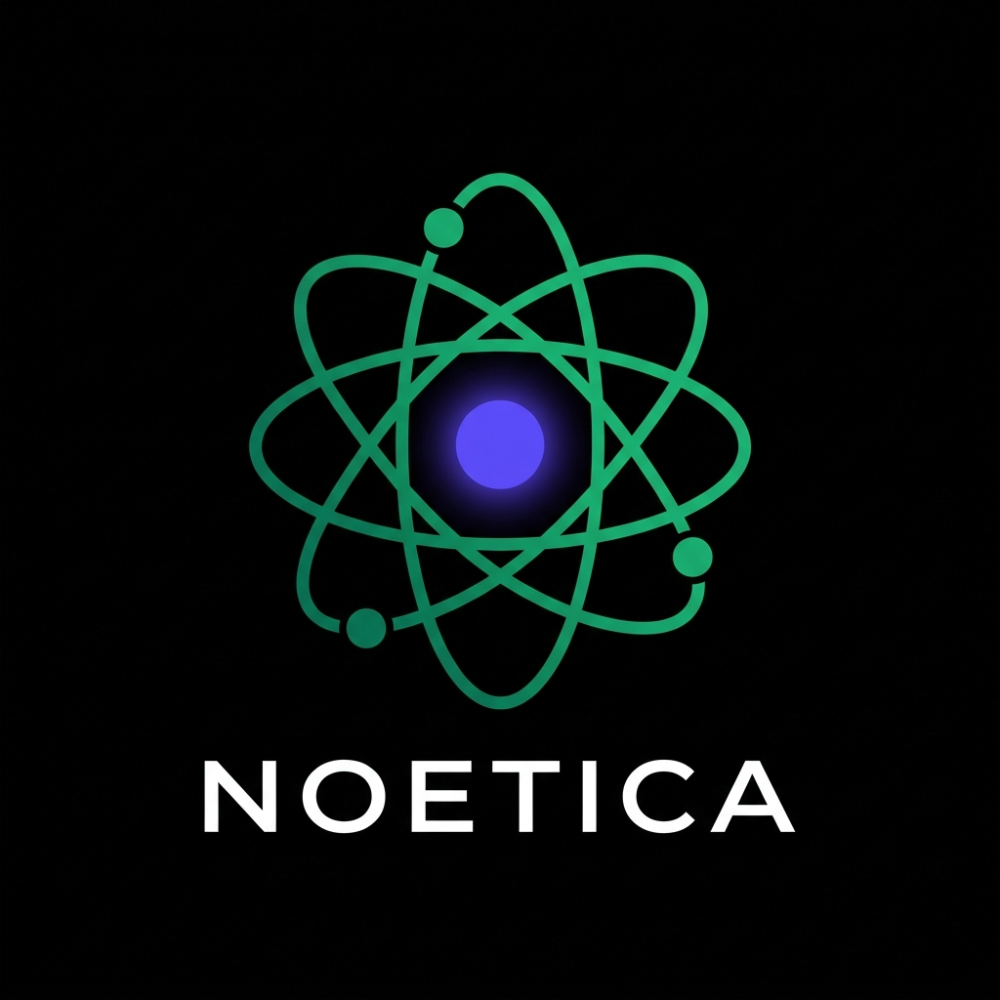

# Noetica
**Mapping the Evolution of Human Knowledge.**

 

<i>Optimizing for Evidence, Scientific Significance, and Civilizational Importance.</i> 
<b><a href="#">VIEW THE LIVE 3D GALAXY DASHBOARD</a></b>

 

Noetica is an autonomous scientific intelligence engine that tracks, scores, and synthesizes global discoveries. 

By scanning thousands of open-source datasets (PubMed, arXiv, patents, global clinical trials, and open-source GitHub repositories) daily, Noetica bypasses hype cycles to identify true empirical breakthroughs. It utilizes a custom Triple-Engine Framework to score papers based on network centrality and evidence, and then deploys a localized LLM to write highly personalized executive intelligence briefings delivered directly to your inbox.

---

## 1. The Triple-Engine Architecture

Noetica operates on an enterprise-grade hybrid-tier architecture combining the massive ecosystem of Python for data ingestion, the raw compiled speed of Zig for O(N^2) Knowledge Graph calculations, and an autonomous LLM Agent for scientific synthesis.

### Engine I: The Python Orchestrator
The core spine of the system (`main.py`) handles the asynchronous logic flow. It triggers the fetchers, interfaces with Google Sheets to map subscriber profiles, and orchestrates the data routing between the Zig engine and the LLM synthesizer. 

### Engine II: The Zig Scoring Engine
To handle high-performance mathematical scoring without the overhead of the Python GIL, Noetica compiles a highly optimized binary using the `Zig` programming language. This engine builds a mathematical knowledge graph to score every discovery across three dimensions (The NET Framework):
- **Novelty:** Measures the presence of breakthrough methodologies versus established paradigms.
- **Evidence:** Quantifies the structural integrity of the methodology (e.g., sample sizes, empirical metrics).
- **Trend:** Evaluates historical citation momentum and cross-disciplinary graph centrality.

### Engine III: The LLM Synthesis Agent
The AI Synthesizer connects to elite foundation models (e.g., Gemini 1.5 Pro or Groq). Designed specifically for deep reasoning, it injects the highest-scoring discoveries and the user's specific expertise level (Beginner vs. PhD) into a highly engineered prompt. This forces the LLM to generate a deeply nuanced, customized HTML executive summary on the fly, bridging the gap between raw scientific data and immediate human comprehension.

---

## 2. Active Learning Loop (Community Consensus)

Noetica does not rely on static algorithms. It features a closed-loop Active Learning system driven by its expert beta testers. 

At the bottom of every discovery in the daily email digest, users are presented with a minimalist feedback interface ("Useful" or "Noise"). When clicked, this feedback is securely routed via Google Forms into a protected Google Sheet database.

During the next cycle (08:00 AM IST daily), the Python Orchestrator's `feedback.py` module ingests this tabular data and cross-references it against the Knowledge Graph. 
- **Positive Feedback:** Creates a mathematical boost for adjacent nodes sharing the same domain or methodology.
- **Negative Feedback:** Down-weights the structural node paths, teaching the Zig Engine to aggressively filter out similar noise in future global ranking cycles.

This ensures the intelligence engine continuously aligns its mathematical scoring with the real-world utility of its expert human readers.

---

## 3. Strict Inbox Protection & Forced Exploration

**Domain Enclosures**
Noetica heavily filters global data to ensure your inbox is strictly protected. If a subscriber configures their profile to receive "Startup Funding" and "Clinical Trials" but explicitly unchecks "Research Papers", the orchestrator creates a hard boundary. Even if the Zig Engine identifies a globally significant Biotech Paper, it will be discarded from that specific user's digest to respect their consent.

**80/20 Forced Exploration**
Algorithms naturally trap humans in echo chambers, showing only what is already known. Noetica mathematically combats this phenomenon by intentionally dedicating 20% of your personalized digest to massive breakthroughs explicitly outside of your selected fields. By injecting high-impact signals from orthogonal domains, it sparks cross-disciplinary creativity and lateral innovation.

---

## 4. 10 Non-Negotiable Principles

These principles serve as the constitution of the Noetica Engine. They override all feature decisions:

1. Optimize for scientific significance, not popularity.
2. Social media is a sensor, not a scoring factor.
3. Discoveries are primary entities, not papers.
4. Knowledge graph over flat category trees.
5. Taxonomy must self-evolve, not be hardcoded.
6. Evidence beats attention, always.
7. Cross-disciplinary discoveries receive higher priority.
8. Open-source data first.
9. Personalization without echo chambers.
10. Long-term civilizational impact > short-term hype.

---

## 5. Deployment & Configuration

Noetica is designed to be fully serverless via GitHub Actions. 

1. A YAML workflow in `.github/workflows` spins up an Ubuntu cloud runner on a cron schedule.
2. It installs the Python dependencies and compiles the Zig engine from source.
3. It executes the Python pipeline, fetching global data and scoring the graph.
4. The HTML digests are generated and dispatched concurrently via SMTP.
5. The runner spins down, costing $0 in perpetual compute.

### Environment Requirements
- `GEMINI_API_KEY` or `GROQ_API_KEY`
- `GOOGLE_SHEET_ID` (Subscriber profiles)
- `FEEDBACK_SHEET_ID` (Active Learning database)
- `SENDER_EMAIL` & `SENDER_PASSWORD` (App Password for SMTP)
