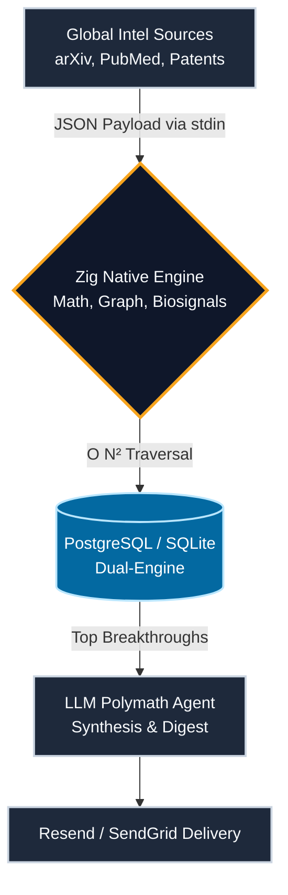

<div align="center">


# Noetica
**Mapping the Evolution of Human Knowledge.**

[](https://opensource.org/licenses/MIT)
[](https://ziglang.org/)
[](https://www.python.org/)
[]()

<br>

<i>Optimizing for Evidence, Scientific Significance, and Civilizational Importance.</i><br>
<b><a href="#">🚀 VIEW THE LIVE 3D GALAXY DASHBOARD</a></b>

<br>
</div>

<hr style="border: 1px solid #1e293b; margin: 40px 0;">

Imagine having an incredibly smart assistant who constantly reads thousands of newly published scientific papers, global patents, venture funding rounds, and clinical trials from all over the world, and then emails you a perfectly summarized, highly-personalized briefing. 

It is your personal, autonomous AI research director.

It is Noetica.

---

## 🚀 How It Works

Noetica runs completely autonomously in the background. Here is what it does:

1. **You Set Your Boundaries:** You fill out a simple Google Form to tell Noetica exactly what you care about. You choose your fields (e.g., Biotech, AI), your expertise level (Beginner vs. Senior Researcher), how much time you have to read, and your specific discovery preferences.
2. **Global Scanning (100% Free):** On a scheduled cycle, Noetica scours massive, free, open-source databases (like Google News, GitHub, PubMed, and Europe PMC) to capture the pulse of global scientific advancement. It skips the paywalls and finds the legal, open-access data.
3. **The "Brain" Engine:** It uses a high-speed custom engine to score every single discovery. It figures out which papers and patents are the most important based on how connected they are to other fields.
4. **AI Personalization:** Noetica uses an advanced AI (Gemini) to read the top discoveries and write a custom "Executive Summary" just for you. If you are a beginner, it explains things simply. If you are a PhD researcher, it gives you the deep technical details.
5. **Inbox Delivery:** A gorgeous, custom-rendered email drops directly into your inbox with your personalized intelligence briefing.

---

## 📬 How to Get Noetica (Early Access)

Noetica is currently in an exclusive Early Access Beta. If you want to experience the future of personalized scientific intelligence, here is how you can join:

### 1. Request Access
Fill out our official **Noetica Onboarding Form** (link provided by your beta administrator). This is where you will define your intellectual boundaries, reading time limits, and expertise level.

### 2. The AI Maps Your Profile
Once submitted, Noetica's backend immediately maps your unique parameters. It calculates your domain intersections and programs the Zig Scoring Engine to hunt specifically for you.

### 3. Receive Your Intelligence
There are no apps to download and no dashboards to log into. On the very next scheduled cycle, your first beautifully formatted, highly-personalized AI Intelligence Briefing will drop directly into your email inbox. 

*Prepare to stop searching for science, and let the science find you.*

---

## ✨ Why Noetica is Different

**Zero Paid APIs (Built for Scale)** 
We explicitly engineered Noetica to avoid expensive enterprise APIs. By leveraging incredibly smart, unified RSS aggregators, public GitHub REST APIs, and government databases (like NIH RePORTER and Europe PMC), you can run Noetica's entire global scanning architecture for exactly $0.

**Strict Inbox Protection** 
Noetica heavily filters global data to ensure your inbox is sacred. *For example:* If you check "Startup Funding" and "Clinical Trials" on the setup form, but leave "Patents" and "Research Papers" unchecked, the system creates a strict filter just for you. Even if it finds a groundbreaking Biotech Patent that perfectly matches your interests, it will instantly discard it because you didn't consent to receiving patents. You are in total control of the data types you receive.

**Break The Silo (Forced Exploration)** 
Algorithms naturally trap us in echo chambers, showing us only what we already know. Noetica fights this by intentionally dedicating 20% of your email to massive breakthroughs *outside* of your selected fields. By injecting high-impact signals from unrelated domains, it sparks cross-disciplinary creativity and "Aha!" moments.

**Respects Your Time limits** 
You don't always have time to read a 50-page digest. When you select that you only have "5 minutes to read," Noetica's algorithm mathematically cuts the final email down to just the top 3 absolute highest-scoring discoveries of the day.

---

## 🧬 10 Non-Negotiable Principles

These principles serve as the constitution of the Noetica Engine. They override all feature decisions:

<table>
  <tr>
    <td width="50%">
      <b>1.</b> Optimize for <b>scientific significance</b>, not popularity.<br>
      <b>2.</b> Social media is a <b>sensor</b>, not a scoring factor.<br>
      <b>3.</b> <b>Discoveries</b> are primary entities — not papers.<br>
      <b>4.</b> <b>Knowledge graph</b> over flat category trees.<br>
      <b>5.</b> Taxonomy must <b>self-evolve</b> — not be hardcoded.
    </td>
    <td width="50%">
      <b>6.</b> <b>Evidence beats attention</b> — always.<br>
      <b>7.</b> <b>Cross-disciplinary discoveries</b> receive higher priority.<br>
      <b>8.</b> <b>Open-source first</b>.<br>
      <b>9.</b> Personalization <b>without echo chambers</b>.<br>
      <b>10.</b> <b>Long-term civilizational impact</b> > short-term hype.
    </td>
  </tr>
</table>

<br>

## 🏛️ V3 Dual-Engine Architecture

Noetica operates on an enterprise-grade hybrid-tier architecture combining the massive ecosystem of Python for data ingestion, the raw compiled speed of Zig for O(N²) Knowledge Graph calculations, and an autonomous LLM Agent for scientific synthesis.



### ⚙️ Core Layers
* **The Orchestrator (Python 3.11):** The core spine of the system (`main.py`) handles the logic flow. It triggers fetchers, parses the Google Sheet subscribers, and routes data to the email builder.
* **The Scoring Engine (Zig 0.16.0):** To handle high-performance mathematical scoring, Noetica compiles a highly optimized binary using the `Zig` programming language. This engine builds a mathematical knowledge graph to score papers based on network centrality and domain convergence.
* **The Intelligence Fetchers:** Found in `v2_fetchers.py` and `fetch_papers.py`, these scripts act as the "eyes" of the system. They perform concurrent HTTP requests to OpenAlex, PubMed, Semantic Scholar, and unified global RSS feeds to ingest raw JSON/XML data.
* **The AI Synthesizer:** `ai_synthesis.py` connects to Google's elite **`gemini-1.5-pro`** model. Designed specifically for deep reasoning and complex scientific synthesis, it injects the top discoveries and the user's expertise level into a highly engineered prompt, forcing the LLM to generate a deeply nuanced, customized HTML executive summary on the fly.
* **The Database Abstraction (`/src/database.py`):** Automatically scales from local SQLite to high-throughput PostgreSQL using dynamic schema mapping.
* **The Automation (GitHub Actions):** The entire system is serverless. A YAML workflow in `.github/workflows` spins up an Ubuntu cloud runner on a cron schedule, installs the dependencies, compiles the Zig engine, runs the Python pipeline, dispatches the emails via SMTP, and then spins down.

<br>

## 💻 Local Development Setup

Noetica is designed to run completely serverless, but if you want to contribute to the engine, you can run the full stack locally.

### 1. Prerequisites
- **Python 3.11+**
- **Zig 0.16.0** (Required to compile the graph engine)
- **Docker Compose** (For Postgres)

### 2. Install Dependencies
```bash
python -m venv venv
source venv/bin/activate  # On Windows: venv\Scripts\activate
pip install -r requirements.txt
```

### 3. Start Database
```bash
cd backend
docker-compose up -d
```

### 4. Configure Environment
Copy `.env.example` to `.env` and fill in your API keys (especially `GEMINI_API_KEY`) and your local Postgres password.

### 5. Run the API
```bash
uvicorn backend.app.main:app --reload
```
The FastAPI backend will be available at `http://127.0.0.1:8000`.

<br>

## 🌍 The Three Timelines of Knowledge

Noetica tracks discoveries across three parallel scopes. Every node in the Knowledge Graph is tracked across a historical lifecycle: `Speculative` ➔ `Emerging` ➔ `Growing` ➔ `Breakthrough` ➔ `Established` ➔ `Foundational` ➔ `Civilizational` ➔ `Historical`.

| Timeline | Scope | Core Question | Real-World Example |
|:---------|:------|:--------------|:-------------------|
| **Foundational** | `5,000+ years` | *What changed civilization?* | Calculus, Germ Theory, Transistors |
| **Modern** | `Last 50 years` | *What changed science?* | CRISPR-Cas9, AlphaFold, mRNA |
| **Emerging** | `Last 5 years` | *What might change the future?* | Quantum Error Correction, LLMs |

<br><br>

<div align="center">
  <i>Human understanding is the ultimate objective.</i>
</div>
