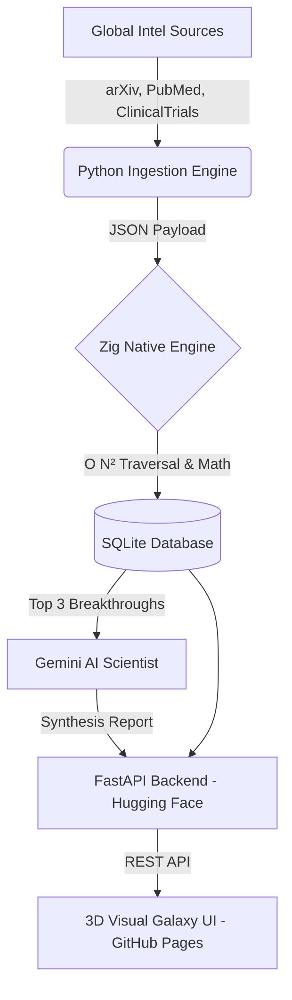

<div align="center">
  
# 🌌 Noetica

**Mapping the Evolution of Human Knowledge.**

[](https://opensource.org/licenses/MIT)
[](https://ziglang.org/)
[](https://www.python.org/)
[]()
[]()

*Noetica optimizes for Evidence, Scientific Significance, and Civilizational Importance.*

**[🚀 VIEW THE LIVE 3D GALAXY DASHBOARD (GitHub Pages)](#)** 
*(Note: Replace the # above with your actual GitHub Pages URL)*

</div>

---

## 📖 Official Definition

Noetica is an open-source scientific intelligence network designed to discover, rank, connect, explain, and forecast the evolution of human knowledge across all disciplines. 

Most systems optimize for attention, engagement, and trending topics. **Noetica optimizes for evidence.** We do not merely track papers. Noetica tracks discoveries, ideas, technologies, theories, knowledge networks, emerging disciplines, and civilization-scale transformations.

### 🧬 Non-Negotiable Principles
1. **Rank discoveries, not papers.**
2. **Evidence over popularity.**
3. **Social media weight = 0%.**
4. **Knowledge is a graph, not a folder structure.**
5. **Forecast with probabilities, never certainty.**

---

## 🏗️ Architecture (V3 Dual-Cloud)

Noetica operates on a cutting-edge hybrid-tier architecture combining the massive ecosystem of Python for data ingestion, the raw compiled speed of Zig for O(N²) Knowledge Graph calculations, and an autonomous LLM Agent (Gemini) for scientific synthesis. 

It is deployed using a completely free **Serverless Dual-Cloud Architecture**.



### Components
- **The Ingestion Layer:** Pulls real-time data from global scientific APIs, including targeted Oncology trials.
- **The Zig Core (`/zig_engine`):** A high-performance mathematics engine that calculates discovery significance, maps cross-disciplinary edges, and assigns **Civilizational Impact Forecast** probabilities.
- **The LLM Agent (`/src/ai_scientist.py`):** An autonomous agent acting as a Polymath Computational Oncologist that synthesizes the Zig rankings into a unified impact report using Google Gemini 1.5 Pro.
- **The 3D Visualizer (`/docs`):** A frontend utilizing WebGL and Force-Directed Graphs to render the Knowledge Graph as an interactive 3D particle simulation.

---

## 🚀 Getting Started

### Prerequisites
* **Python 3.11+**
* **Zig 0.16.0**

### Local Development Setup

1. **Clone the repository**
   ```bash
   git clone https://github.com/Noetica-Intelligence/Noetica.git
   cd Noetica
   ```

2. **Install Python dependencies**
   ```bash
   pip install -r requirements.txt
   ```

3. **Run the V3 Knowledge Graph Pipeline**
   ```bash
   python backend/ingest_v3.py
   ```

4. **Synthesize Data using AI**
   ```bash
   export GEMINI_API_KEY="your-api-key"
   python src/ai_scientist.py
   ```

5. **Boot the Visual Dashboard**
   ```bash
   uvicorn backend.app.main:app --host 0.0.0.0 --port 10000
   ```

---

## 🌍 The Discovery Lifecycle

Every node in the Noetica Knowledge Graph is tracked across its historical lifecycle:
`Speculative` ➔ `Emerging` ➔ `Growing` ➔ `Breakthrough` ➔ `Established` ➔ `Foundational` ➔ `Civilizational` ➔ `Historical`

---

<div align="center">
  <i>Human understanding is the ultimate objective.</i>
</div>
